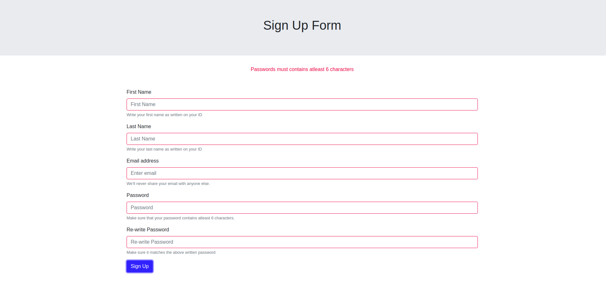

# Sign Up Form

A simple *Sign Up* form which is validated via javascript. In case of invalid input the errors are inserted to DOM elements on runtime via javascript. Moreover the form inputs borders are also dynamically changed to *red* or *green* based on valid or invalid input respectively.

## Interface

It has a responsive interface!




## Instructions

Following are the instructions that you need perform in order to run the application.

1. [Clone the repository](#clone-the-repository)
1. [Running the Application](#running-the-application)


## Clone the Repository

Clone this repository and switch to the `signup` branch as it currently contains the latest code. Run the following commands on your shell.

``` shell
git clone https://github.com/ahmadx16/signup_javascript.git
cd signup_javascript/
git checkout signup
``` 

The above commands will download the repository and switch the branch.

## Running the Application

Running is application is simple. Simply open the index.html file on the browser.
